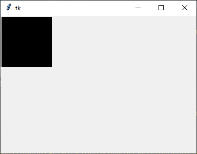

Hunting Down a Bug related to Tcl/Tk in Cygwin with Python
##########################################################

:author: Friedrich Romstedt
:date: August 2021

.. contents::

Description of the Bug and of the Expected Behaviour
====================================================

The bug turns up when trying to display a PIL/Pillow Image in a
``tkinter.Canvas`` using ``PIL.ImageTk`` in Cygwin:

.. code:: python

    # Developed since: August 2021

    import tkinter
    from PIL import Image, ImageTk

    image = Image.new('RGB', (100, 100))

    tk = tkinter.Tk()
    canvas = tkinter.Canvas(tk)
    canvas.pack()

    photoimage = ImageTk.PhotoImage(image)
    canvas.create_image((0, 0),
        image=photoimage,
        anchor='nw',
    )

    tk.mainloop()

The expected result on-screen is (produced with Windows Python 3.8):

    The expected on-screen result of running the reproduction script.

When running the script with Cygwin-Python 3.8 however the following
traceback is produced instead:

.. code:: python

    Traceback (most recent call last):
      File "/usr/lib/python3.8/site-packages/PIL/ImageTk.py", line 176, in paste
        tk.call("PyImagingPhoto", self.__photo, block.id)
    _tkinter.TclError: invalid command name "PyImagingPhoto"

    During handling of the above exception, another exception occurred:

    Traceback (most recent call last):
      File "reproduce.py", line 13, in <module>
        photoimage = ImageTk.PhotoImage(image)
      File "/usr/lib/python3.8/site-packages/PIL/ImageTk.py", line 115, in __init__
        self.paste(image)
      File "/usr/lib/python3.8/site-packages/PIL/ImageTk.py", line 180, in paste
        from . import _imagingtk
    RuntimeError: No such process

Versions Involved
=================

The current versions in the Cygwin package manager are:

    ``Pillow`` as ``python38-imaging-8.1.2-1`` +
    ``python38-imaging-tk-8.1.2-1``.

Also available via the Cygwin package manager:

    ``Pillow`` as ``python38-imaging-7.2.0-1`` +
    ``python38-imaging-tk-7.2.0-1``.

To be able to compile Pillow in older versions, the following ``-devel``
libraries have been made available (based on recommendations given in
https://github.com/python-pillow/Pillow/issues/2860):

#.  ``gcc-core-10.2.0-1``;
#.  ``libjpeg-devel-2.1.0-1``;
#.  ``zlib-devel-1.2.11-1``;
#.  ``libtiff-devel-4.3.0-1``;
#.  ``libfreetype-devel-2.10.4-2``;
#.  ``libfribidi-devel-0.19.7-1``;
#.  ``libharfbuzz-devel-2.8.1-1``;
#.  ``libimagequant-devel-2.10.0-1``;
#.  ``libpng-devel-1.6.37.1``;
#.  ``liraqm-devel-0.7.0-1``;
#.  ``python38-devel-3.8.10-1``.

Furthermore I installed:

#.  ``tk-devel-8.6.11-1``;
#.  ``tcl-tk-devel-8.6.11-1``.

in support of ``tk-8.6.11-1`` and ``tcl-8.6.11-1``.

Other versions of ``Pillow`` which have been tried are:

*   ``Pillow-8.3.1`` (installed from source);
*   ``Pillow-7.2.0`` (installed per Cygwin as ``python38-imaging-7.2.0-1``
    + ``python38-imaging-tk-7.2.0-1``);
*   ``Pillow-6.2.2`` (installed from source);
*   ``Pillow-5.4.1`` (installed from source).

Other versions of Tcl/Tk which have been given a try are:

*   ``tcl``, ``tcl-devel``, ``tcl-tk`` and ``tcl-devel``, all in version
    ``8.6.8-1`` (via the Cygwin package manager).

Attempts to Remedy the Defect
=============================
